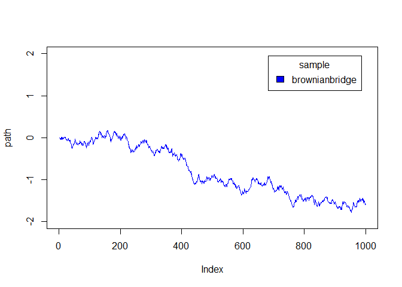

# Precificação de Opção Knock In/Out utilizando Brownian Bridge
Fernando Odair Bristotti  
April 17, 2016  


## Brownian Bridge

Funções utilizadas para criar um sample via brownian bridge, a primeira função varre todos os buckets de forma recursiva e a segunda apenas inicializa os parâmetros para fazer a chamada da função de recursão.


```r
brownbridge.recursive <- function(inf,sup,data){
  if(inf+1>sup){
    return(data)
  }
  
  mid = floor((inf+sup)/2)
  if(mid==inf | mid==sup){
    return(data)
  }
  
  infval = data$sample[inf]
  supval = data$sample[sup]
  
  mean = ((sup-mid)*infval + (mid-inf)*supval)/(sup-inf)
  data$mean[mid] = mean
  sigma = (((sup-mid)*(mid-inf))/(sup-inf)) / length(data$sample)
  
  data$sigma[mid] = sigma
  
  data$sample[mid] = mean + sqrt(sigma) * rnorm(1,0,1)
  data = brownbridge.recursive(inf,mid,data)
  data = brownbridge.recursive(mid,sup,data)
  return(data)
}

brownbridge <- function(n,T,x0=0){
  
  sigma = c(rep(0,n-1),1)
  mean = rep(0,n)
  sample = c(x0,rep(0,n-2),x0+rnorm(1,0,1))
  data = list("sample"=sample,"mean"=mean,"sigma"=sigma)
  
  ini = 1
  fim = n
  
  data =  brownbridge.recursive(1,length(sample),data)
  
  return(data)
}
```

### Exemplo

Exemplo de sample utilizando as funções acima:



## Opção PUT KO

Função utilizada para precificação da PUT KO:


```r
pricing_put_ko <- function(S,K,H,r,T,sigma,N,discret){
  
  prices = rep(0,N)
  touch = rep(0,N)
  
  for(i in 1:N){
    P = S
    hit = 0
    deltaT = T / discret
    C=0
    for(j in 1:discret){
      P = P * exp((r-sigma^2/2)*(deltaT)+sigma*sqrt(deltaT)*rnorm(1,0,1))
      
      if(P < H){
        hit = 1
        break
      }
    }
    if(hit == 0){
      C = max(K-P,0)
    }
    prices[i] = C
    touch[i] = hit
  }
  
  return(list("prices"=prices,"touches"=touch,"price"=mean(prices*exp(-r*T))))
}
```

Parâmetros e execução:

```r
r=0
q=0
S_0=100
K=100
H=85
T=1
vol=.2
N=50000
discret=T*252

ko = pricing_put_ko(S_0,K,H,r,T,vol,N,discret)
```

Preço calculado para a opção:


```r
ko$price
```

```
## [1] 0.8908044
```

Percentual de toques na barreira

```r
length(ko$touch[ko$touch==0]) / length(ko$touch) * 100
```

```
## [1] 56.974
```


## Opção PUT KI

Função utilizada para precificação da PUT KI:


```r
pricing_put_ki <- function(S,K,H,r,T,sigma,N,discret){
  
  prices = rep(0,N)
  touch = rep(0,N)
  
  for(i in 1:N){
    P = S
    hit = 0
    deltaT = T / discret
    C=0
    for(j in 1:discret){
      P = P * exp((r-sigma^2/2)*(deltaT)+sigma*sqrt(deltaT)*rnorm(1,0,1))
      
      if(P < H){
        hit = 1
      }
    }
    if(hit == 1){
      C = max(K-P,0)
    }
    prices[i] = C
    touch[i] = hit
  }
  
  return(list("prices"=prices,"touches"=touch,"price"=mean(prices*exp(-r*T))))
}
```

Parâmetros e execução:

```r
r=0
q=0
S_0=100
K=100
H=85
T=1
vol=.2
N=50000
discret=T*252

ki = pricing_put_ki(S_0,K,H,r,T,vol,N,discret)
```

Preço calculado para a opção:


```r
ki$price
```

```
## [1] 7.132965
```

Percentual de toques na barreira

```r
length(ki$touch[ki$touch==0]) / length(ki$touch) * 100
```

```
## [1] 56.744
```
